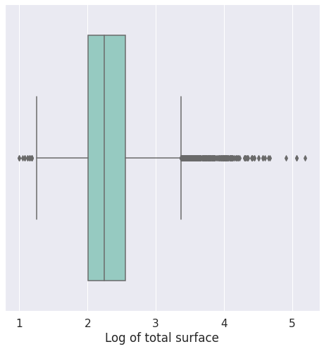
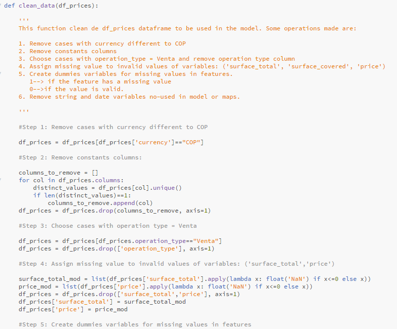

# Price of real estate properties in Colombia

### Project Overview

This project is part of the field of real estate valuation. Usually the sellers of these properties require some guide for the valuation of the property based on some relevant characteristics such as its total surface, the covered surface, the number of rooms, bathrooms and bedrooms, the sector where it is located, and the kind of property.

One way to approach this problem is through the construction of a regression model that allows us to understand the relationship between the variables and the price. In data science this is part of supervised learning techniques.

An analysis of this type can be more complete if, in addition, there is some kind of tool for the presentation of information on maps, when data on its geographical location is available, as this can give an idea of the spatial distribution of prices. The salesperson may also wish to be able to access this information from anywhere, and not just from their workplace desktop, so presenting the information in a web application can be a significant advantage.

Building such a solution goes through several engineering stages, including choosing the architecture for the solution, and integrating with data science techniques for modeling.

In this project we have proposed a solution based on python and flask for the backend, and javascript, bootstrap and css on the frondend. For the aspect graphic, the plotly library has been used, which offers a great variety of graphics, all of them very aesthetic and professional. Regarding the need to draw maps, two powerful tools that come with python have been used: geopandas and Folium. Geopandas allows us to manipulate the data layer of the maps in a very efficient, fast and flexible way. Whereas folium specializes in the production of thematic maps based on data that can be integrated as html resources within a website.

The choice of flask is justified by its simplicity and easy implementation. It allows to manage get and post requests in a very simplified way. It also offers simple ways of routing to html templates to offer different capabilities of interactivity with the user, all this with the dynamism that javascript allows on the client side. Finally, bootstrap and css do the job of giving the website a nice style.

In the modeling stage it is important to mention that there are many approaches to the construction of regression models, from the more classical approach based on multiple linear regression, to more recent approaches based on neural networks, descending gradients or support machines. 

In this project we will use three price estimation approaches: stochastic descending gradient (SVM), support vector regressor(SVR), and multiple linear regression(LR) with categorical variables. To choose the best alternative, a parameter tuning method and model selection based on the mixture (parameters, model) that maximizes the R squared metric is implemented.

Some exploratory results related to the description of missing values in the dataset and the geographic behavior of the residuals of the best fitted model are implemented in the app as a demonstration of the capabilities of plotly, geopandas and folium. We are aware that better and more complete visualizations are possible, but this is an excellent starting point in creating a more robust website as you implement the fundamental layers of the solution.

In relation to the data, these have been taken from a competition that is no longer in force in Kaggle, but at the time, a call was made to data scientists to offer solutions for the modeling of real estate prices in Colombia on a database of 1 Million of records. The database comes from a real environment and has all the characteristics to be considered an interesting challenge.

### Problem Statement:

The problem was posed in terms of the following questions of interest:

1. How can you implement a web app that integrates statistical modeling on referenced data to predict real estate prices in Colombia?

We believe that this first answer is given in the overwiew but it materializes as feasible with the final product of this app.

2. What patterns can be seen in the data regarding the relationship of the variables with the price, and especially their distribution by departments?

3. How accurate can property price prediction be using the three types of models mentioned: SVM, SVR, and LR?

### Metric used to evaluate performance of model:

To evaluate the proposed models, we use the metric R2 which is appropriate when the target variable is continuous. Other metrics are possible, but this one is general enough to be applicable to all three models despite their mathematical and algorithmic differences.

To avoid overfitting problems, one portion of the data is reserved for testing and another for training, and a pipeline-based implementation prevents data linking between the two datasets. Finally, the tuning of parameters on the training data is carried out using a search strategy (GridSearch) that uses cross-validation. The best model chosen after these steps is used to extend the performance review by mapping the median of the squares of the residuals, in order to identify areas of the country for which the model is especially weak in forecasting.

### Data Exploration

Several exploratory data analyzes were carried out. Here is a list and the most important findings:

**Missing values inspection:** In this stage, the amount of missing values for each type of property is counted. An automated report emerged from this work, which in turn feeds a plotly graph (HeatMap) into the web application. For this task, research on the use plotly in conjunction with javascript and ajax was necessary to guarantee interactivity with multiple selection lists manipulated by the user.

The main conclusion was that missing data needed to be imputed in large quantities because many variables were missing for some types of property. This is not convenient because it impairs the possibility of finding the real relationship between the variables by contaminating the data with falsely more constant values. So we impute only in a portion of the records, those whose amount of missing values was not exaggerated.

From this process it was also concluded that there was only quality data to model prices of houses and apartments, so the analysis focused on those two types of property.

**Counting the number of records by department and property**: It was studied whether there was enough information for all the properties. This revealed low data frequencies for many of them, further reinforcing the decision to focus on houses and apartments.

**Counting the number of houses and apartment by Regions**: The data set was supplemented with an extra variable: the region of the country where the property is located. It is known that there are demographic and socioeconomic differences between regions that can impact price, so it was included as part of the analyzes. The idea here was to get the amount of houses and apartments by regions. Orinoquía, Amazonia and Insular are very data-poor regions that were removed.

**Log of price vs other variables**: The relationship of the logarithm of the price with other variables such as: the region, the type of property, the department, was studied in some detail. In some cases, crossing variables taking control of another. The main conclusions were that prices differ between regions, as expected, and by department the behavior can be very dissimilar and with the presence of many atypical data. Boxplots, and violin plot were used for these analyzes.

### Data Visualization

There a natural way to group properties according to their characteristics?. This question was attempted to be answered at the visualization stage.

**Pairplot for features**:  For which a pairplot was drawn to review the relationships between pairs of variables. 

Some conclusions are:

- The variables rooms and bedrooms are highly correlated in the highest zone of their values, which makes sense, the more rooms a house has, the less important is the difference between these two variables. This is also confirmed by observing that the histograms for both variables are very similar.
- The variable region seems to affect the shape of the log price histogram.
- Due to the high correlation between the bedrooms and rooms variables in the high value zone, it would be interesting to separate small houses from large houses before evaluating their impact on the price.
- Due to the volume of data imputed on the variables rooms and bedrooms, the graphs present anomalies, special care must be taken with this aspect when building a predictive model.

**Finding outliers in critical variables**: It is known that outliers greatly impair the predictive ability of a model. That's why we inspect this for critical variables like number of rooms, total surface and covered surface:

All of this information was used in the data preparation stage to build a custom transformer that would remove outliers and conveniently impute data using robust central measures such as the median.

**Inspecting the effect of remove imputed data**: What happens to the pairplot when the mass of input data is not present?. This is what was found:

- The scatter plot between log_price and rooms shows that the regression slope could be steeper for properties with less than 5 rooms than for properties with more than 5 rooms.
- Log_surface_total is positively correlated with log_price, and the same happens with log_surface_covered where the relationship is very clear.
- Regarding the effects of removals, it is clear that eliminating outliers and imputed data generates the loss of a large amount of data, but the relationships are better appreciated.

**Experimenting with PCA for clustering of cases**: It may be appropriate to apply PCA before proceeding to a regression analysis. This allows to visualize natural groupings of the data using clustering.

**Other analysis: Comparison of means**: To detect specific differences between prices by regions we run a multiple comparison test, which is available in the scikit_posthocs package.

<table border="1" class="dataframe">
  <thead>
    <tr>
      <th></th>
      <th>Amazonia</th>
      <th>Andina</th>
      <th>Caribe</th>
      <th>Insular</th>
      <th>Orinoquía</th>
      <th>Pacífica</th>
    </tr>
  </thead>
  <tbody>
    <tr>
      <th>Amazonia</th>
      <td>1.000000e+00</td>
      <td>3.397822e-11</td>
      <td>4.305288e-10</td>
      <td>5.998187e-07</td>
      <td>1.267654e-02</td>
      <td>5.998187e-07</td>
    </tr>
    <tr>
      <th>Andina</th>
      <td>3.397822e-11</td>
      <td>1.000000e+00</td>
      <td>9.647016e-11</td>
      <td>2.716173e-03</td>
      <td>5.869708e-193</td>
      <td>1.281682e-213</td>
    </tr>
    <tr>
      <th>Caribe</th>
      <td>4.305288e-10</td>
      <td>9.647016e-11</td>
      <td>1.000000e+00</td>
      <td>2.484779e-03</td>
      <td>9.759953e-147</td>
      <td>2.097521e-68</td>
    </tr>
    <tr>
      <th>Insular</th>
      <td>5.998187e-07</td>
      <td>2.716173e-03</td>
      <td>2.484779e-03</td>
      <td>1.000000e+00</td>
      <td>8.756284e-06</td>
      <td>6.369389e-04</td>
    </tr>
    <tr>
      <th>Orinoquía</th>
      <td>1.267654e-02</td>
      <td>5.869708e-193</td>
      <td>9.759953e-147</td>
      <td>8.756284e-06</td>
      <td>1.000000e+00</td>
      <td>1.369821e-74</td>
    </tr>
    <tr>
      <th>Pacífica</th>
      <td>5.998187e-07</td>
      <td>1.281682e-213</td>
      <td>2.097521e-68</td>
      <td>6.369389e-04</td>
      <td>1.369821e-74</td>
      <td>1.000000e+00</td>
    </tr>
  </tbody>
</table>

The table above shows the p-value for pairwise comparisons of regions. There are significant differences (with alpha = 0.01) between:

Amazonía vs Andina, Amazonía vs Caribe, Amazonía vs Insular, Amazonía vs Pacífica
Andina vs Caribe, Andina vs Orinoquía, Andina vs Pacífica
Caribe vs Orinoquía, Caribe vs Pacífica
Insular vs Orinoquía
Orinoquía vs Pacífica

In conclusion, there are differences in a large number of regions. It is important to clarify that despite the fact that it is a non-parametric test, atypical data can cause a loss of power. However, exploratory analyzes seem to be supporting this statistical conclusion. Similar analyzes can be done for the other types of properties, and the reader is invited to investigate the data set further.

### Summarizing the main findings in exploratory and visualization stages

- It is useful to take control of the geographical location. With this, greater homogeneity in price is achieved. The violin and boxplot charts created by regions support this conclusion. However, there is still wide intragroup variability that must be explained using additional variables.
- Taking control of the type of property is also important, because as the comparative Choropleths between House and Apartments show, the spatial distribution can be different.
- Considering types of houses according to the values of the explanatory variables is useful to better explain the distribution of the logarithm of prices (changes are noticed when controlling according to cluster). The clusters indicate the following typologies:
   - Small houses (with less than 2 bedrooms) are associated with low values of total area and covered, and define a low sale price.
   - Medium houses (between 3 and 5 bedrooms) are associated with slightly higher values of total and covered area, and their relationship with the sale price, although variable, tends to indicate higher average prices.
   - Large houses (more than 5 rooms) generally have a higher price, but there is a saturation point where more rooms do not mean a significant increase in price.
   - Very large houses (more than 7 rooms) have a higher price in relation to smaller ones, but in this group of properties it is difficult to differentiate the sale prices only based on the number of rooms.
   - The most notable drawback of the present data set is the large amount of imputed data. These cannot be used because they distort the data analysis, resulting in a great loss of data

### Data Preprocessing:

Based on the above findings, a data preprocessing was designed with the following functions:

**For preprocessing before building the model:**

- load_data: Loads the information from the regions.csv and co_properties.csv files. Additionally, the documentation for this function describes the columns of the database.
- clean_data:  Unifies the currency of prices, remove constants columns, choose cases with operation_type = Venta, remove non informative columns, create binary variables for mark missing values, mark invalid values of variables.
- join_data: Unifie two file in one (regions and co_properties)
- save_data: Save cleaned data to sqlLite database.

**For processing during model construction:**

- load_data: Load the cleaned database and add other model-specific cleanings (remove variables not used in the model, keep data only of houses and apartments)
- adjust_data_for_model: create dummies for categorical variable, remove incomplete rows, exclude departments with less of 100 rows in the dataframe, replace price for log10(price), split the dataframe en covariates and target variable.
- buil_model: Construct the pipeline for training model defining a convenient space of parameter and using gridsearch. The space parameter consider feasible mixtures of parameters according to the model class and the relationships between the parameters.
- save_data_to_evaluate_model: In order to present the performance of the model on maps, this function saves the test data set and its predictions.
- save_model: Save the best model like a pkl file.
- input_data.py (customized_transformer): This transformer is important for the removal of outliers and the imputation of medians on missing data. For a more intelligent imputation, the median of the feature is calculated for each department, and then the appropriate value is used over each sample.

**For visualizations in app**:

- report.py: This is the interactive missing values report
- create_choropleth.py: This function allows creating html templates for a desired choropleth for a certain variable to be drawn and a certain group of real estate properties chosen by the user. It exemplifies the power of folium when used in conjunction with geopandas
- create_geodf.py: This function create the data layer for the folium map.

### Summary:

In this project we carry out the analysis of the data available in Kaggle "Colombia Housing Properties Price".

You can download the file from [here](https://www.kaggle.com/julianusugaortiz/colombia-housing-properties-price/download)

This dataset includes real information on property prices in Colombia. Feel free to download the zip file from above link, unzip it, and then place the "co_properties.csv" file inside the **\data** directory of this project.

Before proceeding to use this app it is very important that you take a look at my other github project where I have implemented the exploratory data analysis stage [here](https://github.com/HectorMontes10/Properties_price)

This project does not focus so much on these aspects but on the modeling and deployment in a web app of some visualizations using folium maps to support the understanding of the data and the evaluation of the model.

However, how this project is part of a broader business need, that consists of building regression models for real estate properties in Colombia, you will find on the website some questions that were raised, even though not all the visualizations are on the site.

These are the useful things you will find in this project:

1. The project is a simple app, that uses javascript, and ajax for the frontend, python for the backend, and flask for the communication between the user and the server. In that sense, this is a simple way to understand the basic stages of building a website under the architecture already mentioned. Keeps it simple but complete.

2. We have entered the additional challenge of drawing thematic maps based on data and publishing them on the wep. For this, we have used two great resources: geopandas and folium. These packages together are powerful to present nice visualizations in your app giving you control of the data layer (geopandas) and presentation (folium). The examples are simple: A choroplet for median prices and errors of a prediction model, but complete enough to demonstrate its power.

3. We train a prediction model using pipelines and gridsearch. The first to automate the cleaning and data preparation stage, making the code very readable and maintainable, and avoiding data linking between the training and testing stages. The second to improve the tuning of parameters through search using cross validation.

I sincerely hope that the project is useful for you to understand how an end-to-end web solution is structured. Feel free to use this code for educational or learning purposes, And edit it as much as you consider necessary.

Feedback to improve it will be highly appreciated. 

### Instructions:

1. Run the following commands in the project's root directory to set up your database and model.

    - To run ETL pipeline that cleans data and stores in database
        `python data/process_data.py data/co_properties.csv data/regions.csv data/PropertiesPrices.db`
    - To run ML pipeline that trains classifier and saves
        `python models/train_regressor.py data/PropertiesPrices.db models/regressor.pkl`

2. Run the following command in the app's directory to run your web app.
    `python run.py`

3. Go to http://0.0.0.0:3001/ or localhost:3001

Make sure to create the rules in the firewall to allow http / TCP traffic and grant python permissions so that the execution of the app locally works correctly. Enable listening on port 3001.

Enjoy it

### Files:

The structure for this project is:

- app
   - template
      - master.html  # main page of web app
      - map.html  # The default map before to send information in the app for Choropleth_map
      - Choropleth_map # The Choropleth map produce based on the user interaction with the app
   - static
      - bootstrap-select.css  #css style for selector list in the app
      - bootstrap-select.js  #javascript code for aesthetic presentation of the selection list (this resources [here](http://paulrose.com/bootstrap-select-sass/)
      - geodf.gif (an animated gif to explain the geodatabase aspect)
      - geodf.html (an html table to explain the geodatabase aspect)
   - source
      - depto.dbf
      - depto.prj
      - depto.shp  # Department layer usefull for construct the Choropleth_map.html (this resources [here](https://sites.google.com/site/seriescol/shapes)
      - depto.shx 
   - customized_class
      - create_choropleth.py  #Create the Choropleth based on geodatabase
      - create_geodf.py  #Construct an geodatabase based on shapefile an dataframe of features in pandas.
      - dummy_estimator.py  #Usefull train the model with several estimator. The credit are  for [Brian Spiering](https://stackoverflow.com/questions/38555650/try-multiple-estimator-in-one-grid-search)
      - input_data.py  #Customized transform for input median over missing values and quantile98 over extreme data
      - report.py  #Construct a missing values report for display in the app using plotly graph.     
   - run.py  # Flask file that runs app
- data
   - co_properties.csv  #Data to process 
   - regions.csv  #Data to process
   - process_data.py #python script usefull for preprocessing data (clean database of prices)
   - PropertiesPrices.db   # Database where clean database prices is stored
   - preprocess_data.ipynb  #A jupyter notebook for inspect data used in this model (take a look before starting this project)
- models
   - train_regressor.py  #python script usefull for training model over data (clean database of prices) 
   - regressor.pkl  #saved best model
   - train_regressor.ipynb  #A jupyter notebook for study modelling stage(take a look before starting this project)

Notes:

1. Deleting regressor.pkl model is possible but once this is done you will have to run train_regressor.py again to obtain a new trained model to be used by your application. Model training may take time, depending on the capabilities of your server. training_regressor.py implements gridsearch for tuning parameters, you can edit the parameter search space if you wish for more intensive or less intensive training. You can also change the list of estimators used. In this case we have focused on three: a classical multiple linear regression model, a stochastic descending gradient model, and a vector support regressor. The documentation can be consulted on the sklearn site:

- [Stochastic Gradient Descending](https://scikit-learn.org/stable/modules/sgd.html)
- [Support Vector Regressor](https://scikit-learn.org/stable/modules/svm.html#svm-regression)
- [Linear Model](https://scikit-learn.org/stable/modules/generated/sklearn.linear_model.LinearRegression.html)

2. PropertiesPrices.db is a database that can be deleted, but once this is done it will be necessary to run process_data.py again to create a new clean database of prices. You can edit the script to customize the cleanup tasks on the co_properties.csv and regions.csv files.

3. The documentation of the other functions can be found inside the respective .py file

### Requeriments:

- numpy 1.19.2
- pandas==1.2.4
- sklean==0.22.2
- sqlalchemy==1.4.9
- plotly==4.14.3
- flask==1.1.2
- folium==0.12.0
- geopandas==0.9.0
- scipy==1.19.2
